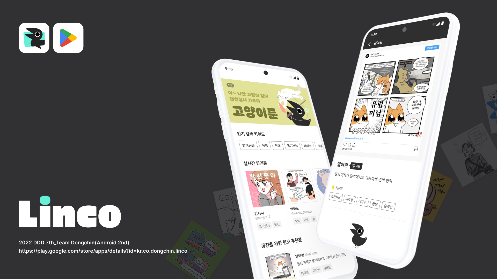

# **Linco**

> **반짝이는 이야기를 모아서 연결해줄게요!**
>
> **인스타툰과 이어주는 오작교!**

****

**** 

## **Android Stack & Libraries 🔨**

- **Minimum SDK level 21**
- **[Kotlin](https://kotlinlang.org/) based**
- **[Coroutines](https://github.com/Kotlin/kotlinx.coroutines) for asynchronous.**
- **JetPack**
  - **LiveData**
  - **Lifecycle**
  - **ViewModel**
- **[Hilt](https://dagger.dev/hilt/) - dependency injection.**
- **[Retrofit2](https://github.com/square/retrofit) - REST APIs.**
- **[OkHttp3](https://github.com/square/okhttp) - implementing interceptor, logging web server.**
- **[Glide](https://github.com/bumptech/glide) - loading images.**
- **[Lottie](https://github.com/airbnb/lottie-android) - implementing animations**

### **Contributors :sparkles:**

<table>
  <tr>
    <td align="center"><a href="https://github.com/jjjoonngg"> <b>김종신</b></a> <a href="#projectManagement-JJJoonngg" title="Android Dev">💻</a></td>
    <td align="center"><a href="https://github.com/moon-i"> <b>최서문</b></a> <a href="#projectManagement-JJJoonngg" title="Android Dev">💻</a></td>
    <td align="center"><a href="https://github.com/YongsHub"> <b>김태용</b></a> <a href="#projectManagement-JJJoonngg" title=Server Dev">💻</a></td>
  </tr>
</table>

